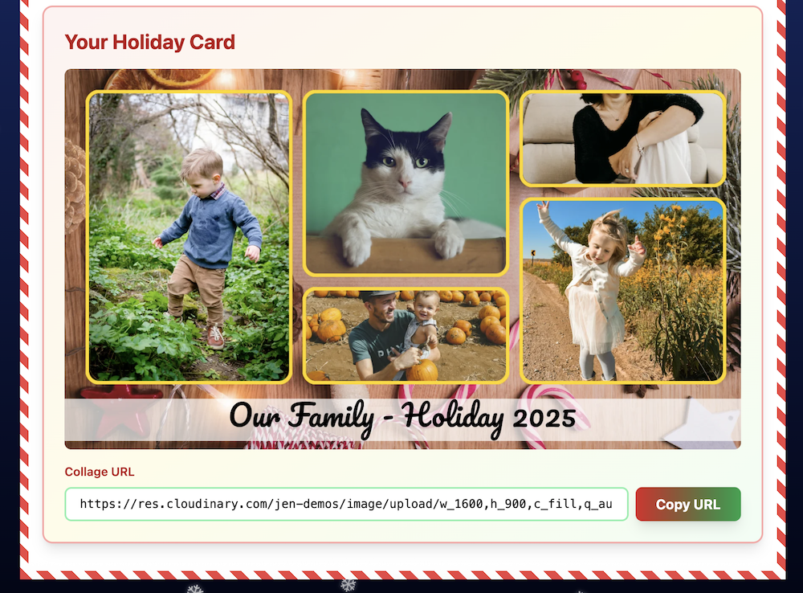

# Family Holiday Collage Maker

A beautiful web app built with Astro, React, TypeScript, and Tailwind CSS that lets families upload photos and generate shareable holiday collages using Cloudinary transformations.



## Features

- Upload multiple family photos via Cloudinary Upload Widget
- Customize family name for the collage
- Automatically generate a festive collage with:
  - Holiday background image
  - Up to 3 uploaded photos arranged in a grid
  - Family name and year text overlay
- Copy the generated collage URL to share with family and friends

## Prerequisites

- Node.js 18+ and npm
- A Cloudinary account (free tier works fine)
- A Cloudinary Upload Preset configured for unsigned uploads

## Setup

1. **Install dependencies:**
   ```bash
   npm install
   ```

2. **Configure environment variables:**
   
   Create a `.env` file in the root directory:
   ```env
   PUBLIC_CLOUDINARY_CLOUD_NAME=your_cloud_name_here
   PUBLIC_CLOUDINARY_UPLOAD_PRESET=your_upload_preset_here
   ```
   
   To get these values:
   - **Cloud Name**: Found in your Cloudinary Dashboard
   - **Upload Preset**: 
     1. Go to Cloudinary Dashboard → Settings → Upload
     2. Create a new Upload Preset (or use an existing one)
     3. Set it to "Unsigned" mode
     4. Copy the preset name

3. **Prepare the background image:**
   
   The app expects a background image at the public ID `holiday-assets/collage-bg` in your Cloudinary account.
   
   To upload it:
   - Go to your Cloudinary Media Library
   - Create a folder named `holiday-assets` (or use an existing folder)
   - Upload a background image (1600x900px recommended) and name it `collage-bg`
   - Alternatively, you can modify the `backgroundId` in `src/lib/collage.ts` to match your actual background image public ID

4. **Prepare the white pixel image:**
   
   The app needs a white pixel image for the ribbon behind the text. You'll need to upload a small white image to your Cloudinary account.
   
   To create and upload it:
   - Create a 1x1 or 10x10 white PNG image (any small white image will work)
   - Go to your Cloudinary Media Library
   - Upload the white pixel image to the `holiday-assets` folder (or any folder)
   - Name it `white-pixel` (or use any name you prefer)
   - Update the `whitePixelPublicId` in `src/lib/collage.ts` to match your uploaded image's public ID
   - For example, if uploaded to `holiday-assets/white-pixel`, set: `const whitePixelPublicId = 'holiday-assets/white-pixel';`

4. **Run the development server:**
   ```bash
   npm run dev
   ```

   The app will be available at `http://localhost:4321`

## Building for Production

```bash
npm run build
```

The built files will be in the `dist/` directory.

## How It Works

1. Users enter their family name
2. Click "Add family photos" to open the Cloudinary Upload Widget
3. Select and upload photos (up to 10, but only first 3 are used in collage)
4. The app automatically generates a Cloudinary transformation URL that:
   - Resizes to 1600x900px
   - Overlays up to 3 photos in a grid layout
   - Adds a text overlay with the family name and year
   - Uses a festive background image
5. Users can copy the generated URL to share the collage

## Project Structure

```
├── src/
│   ├── components/
│   │   ├── FamilyCollageApp.tsx    # Main React component
│   │   └── UploadWidget.tsx        # Cloudinary upload widget wrapper
│   ├── layouts/
│   │   └── BaseLayout.astro        # Base layout with Cloudinary script
│   ├── lib/
│   │   └── collage.ts              # Collage URL builder utility
│   └── pages/
│       └── index.astro             # Main page
├── astro.config.mjs                # Astro configuration
├── tailwind.config.mjs             # Tailwind CSS configuration
└── package.json
```

## Technologies

- **Astro** - Web framework for content-driven sites
- **React** - UI library for interactive components
- **TypeScript** - Type-safe JavaScript
- **Tailwind CSS** - Utility-first CSS framework
- **Cloudinary** - Image and video management platform

## License

MIT

